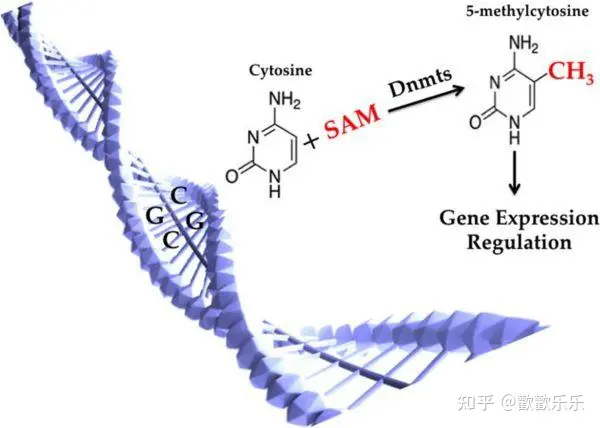

## DNA methylation
表观遗传学(Epigenetics)是指DNA序列不发生变化,但基因表达却发生可遗传的改变,包括**DNA甲基化**、**组蛋白修饰**、**染色体重塑**和**非编码RNA调控**等    
DNA甲基化(DNA methylation)为DNA化学修饰的一种形式,即在DNA甲基化转移酶的作用下,基因组CpG二核苷酸的胞嘧啶5'碳位共价键结合一个甲基基团。
### DNA甲基化的类型    
  1. 2条链均未甲基化的DNA被甲基化,称为从头甲基化(denovo methylation)
  2. 双链DNA的其中一条链已存在甲基化,另一条未甲基化的链被甲基化,这种类型称为保留甲基化(maintenance methylation)

 
